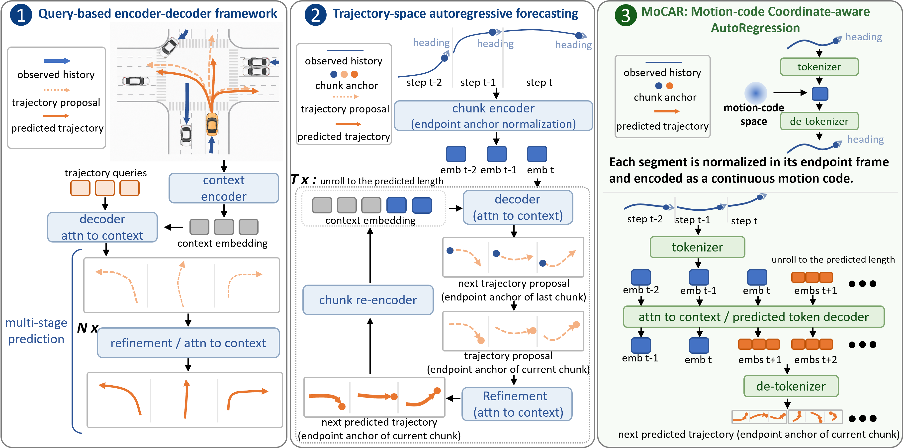
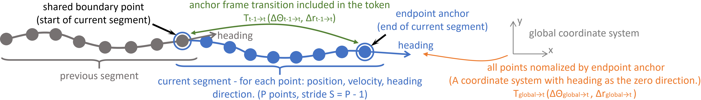
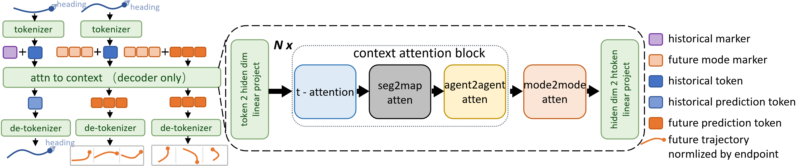
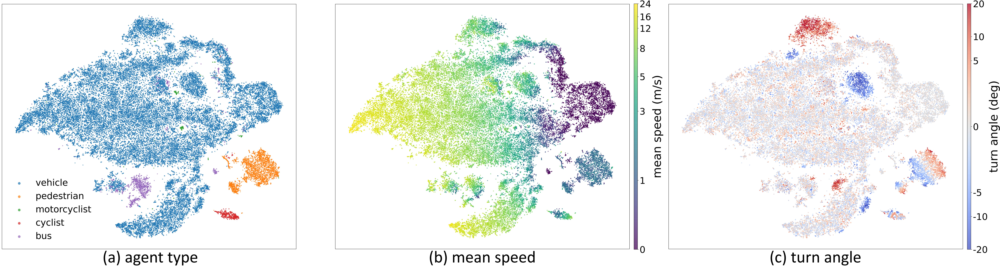
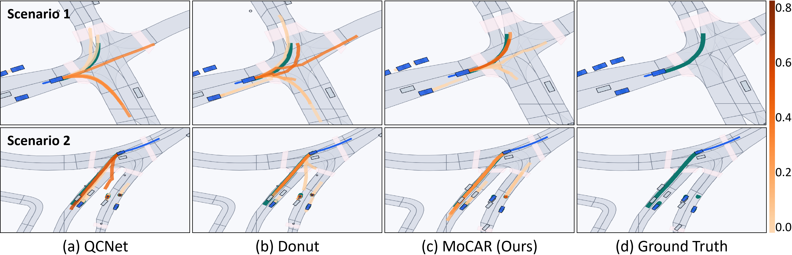

# MoCAR

🎉 **News: MoCAR has been accepted to NeurIPS 2026!**

Official-style code release for **MoCAR: Motion-code Coordinate-aware AutoRegression for Continuous Trajectory Forecasting**.

MoCAR formulates motion forecasting as decoder-only next-code prediction in a continuous, coordinate-aware motion-code space. Historical trajectory chunks are encoded with teacher forcing, future chunks are rolled out autoregressively in latent space, and each latent token represents both local motion geometry and the endpoint coordinate-frame transition induced by that chunk.



## Method Overview

MoCAR learns endpoint-normalized continuous motion codes with a VAE. Each trajectory segment is represented in the local coordinate frame of its endpoint anchor, so the token couples trajectory state and frame transition. During forecasting, the model reuses encoded history tokens and predicts future motion codes directly, without trajectory queries, proposal refinement, or trajectory-space re-tokenization.





The learned code space forms a structured continuous motion vocabulary. In the paper, t-SNE visualizations of AV2 validation chunks show organization by agent type, speed, and turning behavior.



Qualitative examples compare MoCAR with QCNet and DONUT on challenging AV2 scenes. MoCAR keeps predictions more coherent through large intersections and interaction-heavy cases.



## Contents

- `model_MoCAR/`: MoCAR model, chunk VAE, and map encoder.
- `assets/`: paper figures used in this README.
- `model_MoCAR/base.py`: abstract decoder substrate composed from tokenization, graph, and loss interfaces.
- `model_MoCAR/decoder.py`: decoder-only trajectory-token rollout module.
- `model_MoCAR/auxiliary.py`: optional intermediate-layer auxiliary losses, imported only when enabled.
- `model_MoCAR/tokenization.py`: endpoint-normalized trajectory token construction.
- `model_MoCAR/graph.py`: sparse token/agent/map graph builders.
- `model_MoCAR/losses.py`: token reconstruction objectives.
- `Datasets/`: AV2 preprocessing and dataset loaders.
- `datamodules/`, `transforms/`: PyTorch Lightning data module and target builder.
- `layers/`, `metrics/`, `losses/`, `utils/`: model dependencies.
- `train_av2.py`: AV2 training entry point.
- `validate_av2.py`: standard AV2 validation from a checkpoint.
- `get_target.py`: export trajectory chunks used to pretrain the chunk VAE.
- `visualization.py`: professional AV2 scenario renderer for MoCAR predictions.

## Environment

The project does not require a custom environment. Use the official PyTorch and PyG installation commands for your CUDA version, then install the remaining Python packages.

### 1. Create a Conda Environment

```bash
conda create -n mocar python=3.10 -y
conda activate mocar
python -m pip install --upgrade pip
```

### 2. Install PyTorch

Install PyTorch following the command generated by the official PyTorch selector: https://pytorch.org/get-started/locally/

```bash
# Example for CUDA 12.1. Replace this with the command from pytorch.org if your CUDA version is different.
pip install torch torchvision torchaudio --index-url https://download.pytorch.org/whl/cu121
```

For CPU-only installation, use the CPU command from the PyTorch website instead.

### 3. Install PyTorch Geometric

Install PyG following the official PyG instruction for your PyTorch and CUDA versions: https://pytorch-geometric.readthedocs.io/en/latest/install/installation.html

```bash
pip install torch-geometric
pip install torch-cluster -f https://data.pyg.org/whl/torch-$(python -c "import torch; print(torch.__version__.split('+')[0])")+cu121.html
```

If your PyTorch build is CPU-only or uses a different CUDA version, replace `cu121` with the matching tag from the PyG installation page.

### 4. Install Project Dependencies

```bash
pip install -r requirements.txt
```

### 5. Verify the Installation

```bash
python - <<'PY'
import torch
import torch_geometric
import av2

print("torch:", torch.__version__)
print("cuda available:", torch.cuda.is_available())
print("pyg:", torch_geometric.__version__)
print("av2 import: ok")
PY
```

## Data

The datamodule expects compressed AV2 HeteroData files:

```text
<root>/<processed>/train.dat
<root>/<processed>/val.dat
<root>/<processed>/test.dat
```

Use `Datasets/argoverse_v2_preprocess.py` to create processed samples from raw AV2:

```bash
python Datasets/argoverse_v2_preprocess.py --root /path/to/raw_av2 --split train
python Datasets/argoverse_v2_preprocess.py --root /path/to/raw_av2 --split val
python Datasets/argoverse_v2_preprocess.py --root /path/to/raw_av2 --split test
```

By default, the script writes `<root>/MoCAR_data/<split>.dat`. Pass `--processed_dir /path/to/av2_data/MoCAR_data` if the processed files should be stored separately from the raw AV2 directory.

## Chunk VAE Targets

```bash
python get_target.py --root /path/to/av2_data --processed MoCAR_data --split train --output /path/to/chunk_vae_train.dat
```

## Train

```bash
python train_av2.py --root /path/to/av2_data --processed MoCAR_data
```

Auxiliary intermediate-layer supervision is optional. Enable it explicitly when training the full auxiliary-loss variant:

```bash
python train_av2.py --root /path/to/av2_data --processed MoCAR_data --use_aux_loss
```

Position-noise augmentation during chunk construction is also optional. `--chunk_noise_ratio` is the per-vehicle sampling probability in each batch, and `--chunk_noise_sigma` is the Gaussian standard deviation in meters:

```bash
python train_av2.py \
  --root /path/to/av2_data \
  --processed MoCAR_data \
  --chunk_noise_ratio 0.2 \
  --chunk_noise_sigma 0.1
```

## Validate

```bash
python validate_av2.py --root /path/to/av2_data --processed MoCAR_data --ckpt_path /path/to/model.ckpt
```

## Visualize

The script can be run directly from PyCharm after editing the constants at the top of `visualization.py`.

```bash
python visualization.py \
  --root /path/to/av2_data \
  --processed MoCAR_data \
  --map_root /path/to/raw_av2/val \
  --checkpoint /path/to/model.ckpt \
  --start_index 500 \
  --end_index 600
```

Generated data, model checkpoints, and experiment outputs are intentionally ignored by git.
